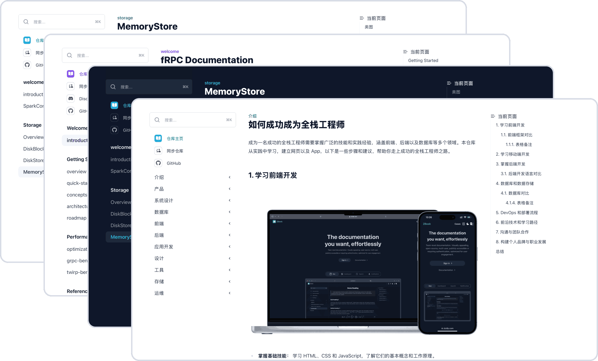

<h1 align="center">ZBook</h1>
<p align="center">
  <a href="https://github.com/zizdlp/zbook-docs">Documention</a> - <a href="https://github.com/zizdlp/zbook-helm-chart">Helm Chart</a>  - <a href="https://discord.com/channels/1250069935594536960/1250069935594536963">Discord</a> - <a href="https://www.youtube.com/channel/UC9D6VAJRoG7bD38dz8F9CSg">Youtube</a>
</p>

<div align="center">

[](https://github.com/zizdlp/zbook/actions)
[](https://github.com/zizdlp/zbook/actions)
[](https://github.com/zizdlp/zbook/actions)
[](https://dl.circleci.com/status-badge/redirect/gh/zizdlp/zbook/tree/release)

</div>

[中文版](README_zh.md)

------
<p align="center">Welcome to ZBook, a fully open-source full-stack knowledge base management software for teams.</p>
<p align="center">This repository contains the open-source code used to render and serve ZBook</p>

<p align="center">
  
</p>

## Table of Contents

- [Getting Started](#getting-started)
- [Features](#features)
- [Deployment](#deployment)
- [Licensing](#license)
- [Acknowledgements](#acknowledgements)

## Getting Started

To run a local version of this project, please follow these simple steps.

### Prerequisites

- docker & docker-compose

### Set up

1. Clone the repo into a **public** GitHub repository. If you plan to distribute the code, keep the source code public to comply with GNU GPLv3.

    ```shell
    git clone https://github.com/zizdlp/zbook.git
    ```

2. Build & run your local development server

    ```shell
    make compose_pull
    ```

3. Then open the space in your web browser, using <http://localhost:3000/>

4. 🍻 To use email services and third-party account login, please apply first. For details, please refer to [ZBook User Guide](https://github.com/zizdlp/zbook-user-guide).

### CI and testing

All pull-requests will be tested against both visual and performances testing to prevent regressions.
ZBook is fully open-source and built on top of [Next.js](https://nextjs.org/).

### Types of contributions

We encourage you to contribute to ZBook to help us build the best tool for documenting technical knowledge. If you're looking for some quick ways to contribute, continue reading to learn more about popular contributions.

#### Translations

The ZBook UI is rendered using a set of translation files found in [`zbook_frontend/messages`](/zbook_frontend/messages/). We welcome all additional translations for the UI.

#### Bugs

Encounter a bug or find an issue you'd like to fix? Helping us fix issues related to ZBook greatly improves the experience for everyone. Head to the issues section of this repository to learn more about the types of bugs you can already help out with.

## Features

Support:

- **full-stack**: a full-stack software utilizing Next.js and Tailwind CSS for the frontend, Golang gRPC for backend services, PostgreSQL for database management, and MinIO for storage, and WebSocket for real-time messaging notifications.
- **multi-level permission management**: Support for various repository visibility options including public, login-only, selected users, and creator-only access.
- **Comments**
- **Notifications**
- **open source**

Not Support:

ZBook does **not support online editing**. We believe that tools like Git in local environments such as VS Code and Typora are sufficient for editing and collaborating on content. **Online editing is not essential** in our view. Additionally, enabling online editing would require granting write permissions to Git repositories, which could pose **security risks**.

## Deployment

For privacy and other reasons (for private repositories, you may need to input an access token; although GitHub supports fine-grained access tokens that can grant specific permissions to specific repositories, such as read-only), we encourage you to deploy ZBook yourself. You can use docker-compose or a k8s cluster for deployment. For details, please refer to the [ZBook User Guide](https://github.com/zizdlp/zbook-user-guide).

## License

Distributed under the [GNU GPLv3 License](https://github.com/zizdlp/zbook/LICENSE).

If you plan to distribute the code, you must the source code public to comply with GNU GPLv3.
See `LICENSE` for more information.

## Acknowledgements

ZBook wouldn't be possible without these projects:

- [Next.js](https://nextjs.org/)
- [Tailwind CSS](https://tailwindcss.com/)
- [GoldMark](https://github.com/yuin/goldmark)

## Contributors

<a href="https://github.com/zizdlp/zbook/graphs/contributors">
  
</a>
